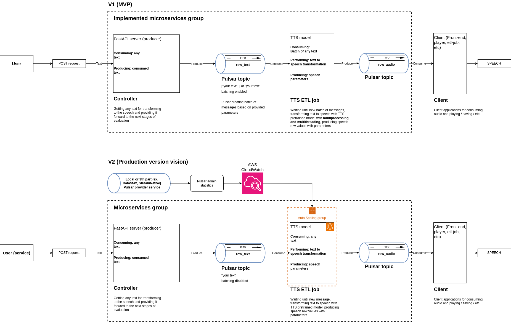

# TTS integrated microservices
***
## Task Description
###  Pre-trained TTS [VITS](https://github.com/jaywalnut310/vits) Model Service leveraging Apache Pulsar
Design and implement a service architecture that incorporates Apache Pulsar to handle
inference requests for a pre-trained TTS VITS model. The service should be capable of
efficiently processing both short and long text inference requests without allowing long
requests to disrupt the processing of short ones.
***

## Project description
Project created based on the task and on imaginary scenario. 
Project contains 2 **microservices** - tts_api and tts_service. Apart from microservices there is used
3th part services. 
Project is very simple. User (it can be service) providing texts via REST API, texts streaming one by one or by batches
to the tts_service, tts_service transforming text to speech and streaming audio parameters to the next layers.

### Microservices
- tts_api: tts_api is FastAPI based backend application for getting requests from clients and users (services).
- tts_service: tts_service is TTS pretrained model integrated microservice which supposed to transform text to speech.

### 3th part services
- Apache Pulsar: Pulsar is streaming/messaging system which used for stream connection between microservices.
- vits*: vits is github repository with pretrained TTS models and with implemented tools for interacting with models. 
It is not 3th part service, but it is listed here because it used here without big changes and responsibilities do not 
changed.

## Project design
All schemas find [here](https://drive.google.com/file/d/1ZTVqYFC4gpzbOfh4BEs0FzyAWG-wav4S/view?usp=sharing)

- **V1**: Current implemented MVP version.
- **V2**: Production version vision. It is not final version, depends on project adjustments it is possible to have 
modifications onto design.

### Generic design


### TTS_service detailed design


**V1 Important notes**
- Pulsar topics and consumers:
  - Each topic can handle multiple connections. It is one of the key features of pulsar topics, it allow us to scale 
  consumers as much as we need
- N number of processes are fixed*:
	- Since there are no iterations, using ProcessPoolExecutor isn't feasible without implementing third-party
  monitoring and cleaning services. Depending on Python's garbage collector is unreliable.
- Pulsar connections: 
  - Each subprocess creates it's own connection to the pulsar topic. It allow to isolate queue responsobility inside 
  Pulsar and make etl-job as simple as it possible
- Threads are using for evaluating all messages in batch:
  - It is not perfect solution, but it could allow next modules do not wait for the next message while previous 
  transforming

**V2 Important notes**
- N number of processes (ECS tasks) are adaptive*:
	- As we have adaptive power, we can use ProcessPoolExecutor with machines with more than 1 phisical thread, it could allow us to handle batches if little delays and batching acceptable.

# Steps for running service
***
## Installation:
### Python Setup
**Required to use Python 3.6**. Other Python versions have problems with vits.
If you have cloned this repository and created a virtual environment for it. You can install all the dependencies
by running:
``` bash
pip3 install -r requirements.txt
```
or:
``` bash
conda create --name <env> --file <this file>
```
### vits setup
For vits setup investigate [vits](https://github.com/jaywalnut310/vits?tab=readme-ov-file) repository and requirements.

### Pulsar setup
For pulsar setup investigate [official documentation](https://pulsar.apache.org/docs/3.2.x/getting-started-standalone/).
If you want to use docker and simply use this service, install docker. In case of running pulsar service described below 
pulsar image would be downloaded automatically.

***
# Usage
## Running services
**It is important to follow queue described in this document**

1. Run first Pulsar service. There is multiple options for running service. Here we will use docker

    ```bash
    sudo docker run -it \
    -p 6650:6650 \
    -p 8080:8080 \
    -e PULSAR_STANDALONE_USE_ZOOKEEPER=1 \
    --mount source=pulsardata,target=/pulsar/data \
    --mount source=pulsarconf,target=/pulsar/conf \
    apachepulsar/pulsar:3.2.2 \
    bin/pulsar standalone --wipe-data
    ```

2. Run first (Client service)
    ``` bash
    python -m uvicorn tts_api.tts_api_main:app --reload
    ```
    Open ```http://127.0.0.1:8000/docs``` in a browser and test API locally

3. Run tts_service
    ```bash
    python tts_service/tts_service_main.py
    ```

4. Connect to the last layer via any python interpreter for reading TTS result. With jupyter notebook you can connect
with the following code:
    ```python
   import pulsar
   client = pulsar.Client('pulsar://localhost:6650')
   consumer = client.subscribe('row_audio', subscription_name='my-sub')
   data = consumer.receive()
   consumer.acknowledge(data)
   client.close()
    ```

***
## Contributing guidelines
Thank you for following them!

### Branching strategy
Nothing new, nothing fancy:
* "Main" Branch:This is the primary branch that represents the production-ready version of the codebase. Developers 
should aim to keep this branch stable, and it should only contain code that has been fully tested and is ready
for release.

* "Development" Branch:This branch is used to integrate new code changes and features that are not yet production-ready.
Developers work on this branch to implement new functionality, fix bugs, and make improvements to the codebase. 
Once the changes are tested and validated, they are merged into the main branch for release.

* "Features" Branch:Feature branches are used to develop new features or major changes to the codebase. These 
branches are created off the development branch and allow developers to work independently on specific features 
without interfering with the development of other features.

* "Hotfixes" Branch:Hotfix branches are used to quickly address critical issues or bugs in the codebase that require
immediate attention. These branches are created off the main branch and allow developers to fix issues without
disrupting the development of new features on the development branch. Once the fix is complete, the hotfix branch is
merged back into the main branch.

### New features or refactorings
- Create a branch from development branch.
- Describe the changes you made and why you made them. If there is a JIRA task associated, please  write its reference.
- Implement your changes
- Ensure that the code is properly formatted and passes all existing tests. Create new tests for new methods or classes.
- Make sure to update the documentation if necessary
- Ask for a merge request to the development branch as soon as possible to avoid differences overlapping.

### CI/CD
- vits: **As torch required to have Nvidia video card for init and I did not refactor vits, right now CI/CD do not cover 
vits unit tests**
- Pulsar: I did not create testing environment for pulsar infra
  - Based on quick research I assumed that there is a bug in Python 3.6 with ubuntu, many people facing
  issues with running couple of packages. If you are meeting **segmentation** issues with pytest please ignore
  ```tests/test_pulsar_provider.py``` test on local machine.
#### Coverage
In this repo we are using coverage to check the code coverage of the tests. You can test it by running
``` bash
 coverage run -m pytest 
```
Then you can visualize the coverage report with:
``` bash
 coverage report
```
The highest the coverage the better! Also, make sure that every file is being covered.
Personally, if you are using Pycharm-Pro I recommend use the function "Run Python tests in tests with coverage" as it 
will allow you to see which lines are not under coverage.

## Future Work
- Add more unit and integration tests.
- Replace "weird combination" of multiprocessing ang threading with ProcessPoolExecutor.
- Improve parallelism.
- Create new and clean TTS model handler and remove **vits**
- Configure torch unit tests in github CI/CD